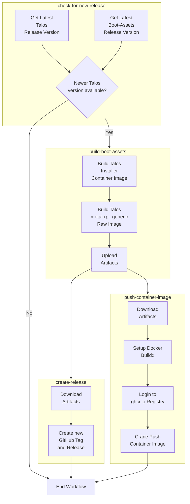

# talos-boot-assets

## Workflow

```mermaid
flowchart TD

subgraph check-for-new-release
    GetTalosRelease[Get Latest\nTalos\nRelease Version]
    GetBootAssetRelease[Get Latest\nBoot-Assets\nRelease Version]

    GetTalosRelease-->NewVersionAvail
    GetBootAssetRelease-->NewVersionAvail

    NewVersionAvail{Newer Talos\nversion available?}
end

NewVersionAvail -->|Yes| build-boot-assets
NewVersionAvail -->|No| End

subgraph build-boot-assets
    BuildInstaller[Build Talos\nInstaller\nContainer Image]
    BuildInstaller --> BuildRpi[Build Talos\nmetal-rpi_generic\nRaw Image]
    BuildRpi --> UploadArtifacts[Upload\nArtifacts]
end

UploadArtifacts --> create-release
UploadArtifacts --> push-container-image

subgraph create-release
    DownloadCreateRelease[Download\nArtifacts]
    DownloadCreateRelease --> CreateNewRelease[Create new\nGitHub Tag\nand Release]
end

subgraph push-container-image
    DownloadPushContainer[Download\nArtifacts]
    DownloadPushContainer --> SetupDockerBuildX[Setup Docker\nBuildx]
    SetupDockerBuildX --> LoginToGhcr[Login to\nghcr.io Registry]
    LoginToGhcr --> CranePush[Crane Push\nContainer Image]
end

CreateNewRelease --> End
CranePush --> End

End[End Workflow]
```
