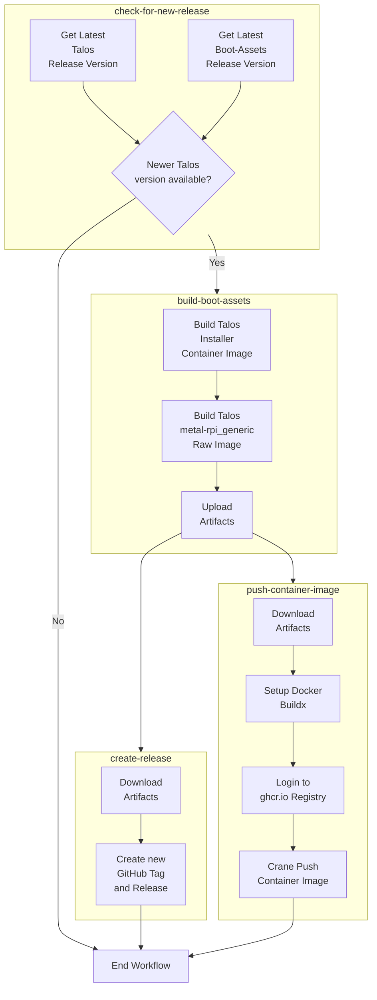

# talos-boot-assets

## Overview

This repository contains a [GitHub Actions](https://docs.github.com/en/actions) workflow that runs on a cronjob every 
day to check and see if a new official [Talos Linux](https://github.com/siderolabs/talos) release has been pushed.

If it detects a newer version is available (compared to the tag(s) in this repo) it will use the 
[Talos Imager](https://github.com/siderolabs/talos/tree/v1.5.0/pkg/imager) to build new 
[Boot Assets](https://www.talos.dev/v1.5/talos-guides/install/boot-assets/) used in my 
[home-ops](https://github.com/justingarfield/home-ops) environment.

## Release Artifacts

Currently I output two final artifacts from this workflow:

* `metal-rpi_generic-arm64.raw.xz` which shows up under releases, used for Raspberry Pi 4s
* `metal-amd64-installer` which shows up under packages, used for Hyper-V VM installs

## Workflow

